# 基于CNN和RNN的医疗科室推荐模型

本项目用CNN和RNN分别对中文问诊文本进行分类，用于医生科室推荐。

数据集来源： https://github.com/kklyyl/word2vec-text-cnn ，但并未参考其方案；同时对部分类别进行归并，最终得到13个类别。

项目源码： https://github.com/PersonaRinata/GreenFish-DeepLearning

## CNN（卷积神经网络）

### 模型结构


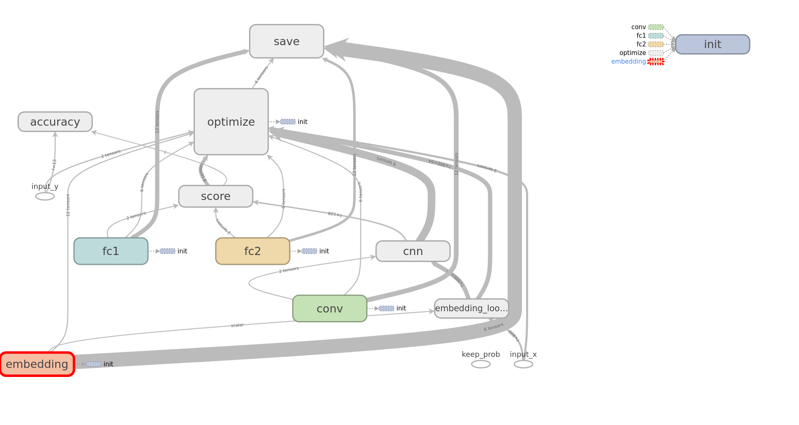

下面简要讲述一下各个模块的思路：

#### embedding

这一模块创建了一个词嵌入矩阵，其中每行对应一个词汇表中的单词。

1. 将输入序列中的单词索引映射为对应的词嵌入向量，得到嵌入输入。
2. 此过程用于将离散的词汇信息转化为密集的词嵌入表示，以便于神经网络模型的处理。

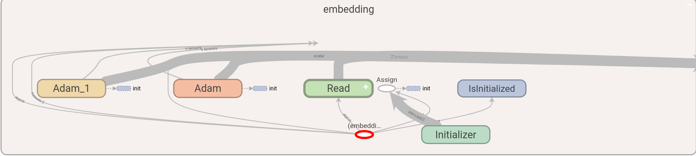

#### cnn

这一模块构建了一个一维卷积神经网络（CNN）层，用于提取输入序列中的重要特征。

1. 对输入的嵌入序列进行卷积操作，使用指定数量的卷积核和卷积核大小。
2. 通过全局最大池化（Global Max Pooling），在卷积输出的每个通道上选择最大值，得到一个全局池化后的特征向量。

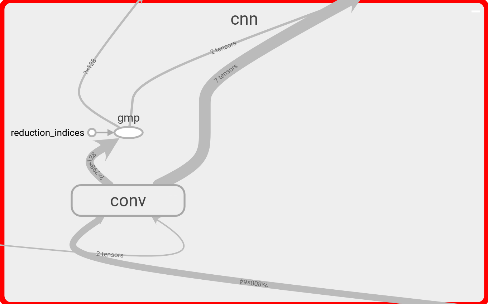

#### score

这一模块构建了一个分数计算部分，通过全连接层对全局最大池化后的特征进行映射，用于将提取到的特征映射到类别空间，从而进行分类。

1. 使用一个全连接层（`fc1`）将全局最大池化的特征向量映射到隐藏维度
2. 使用`dropout`正则化和`ReLU`激活函数。
3. 使用另一个全连接层（`fc2`）将映射后的特征进一步映射到输出类别的空间。
4. 使用`softmax`函数获取类别概率，再通过`argmax`得到预测类别。

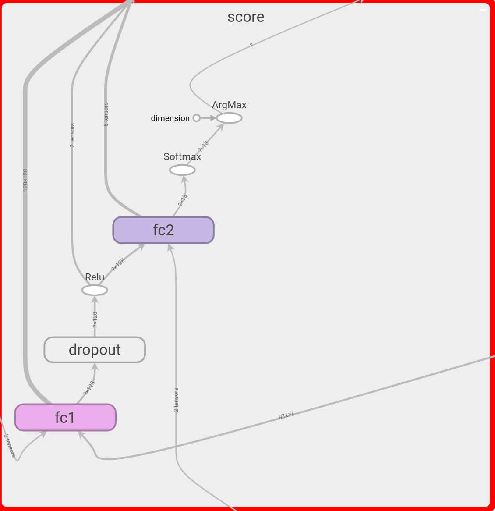

其中的两个全连接层结构类似

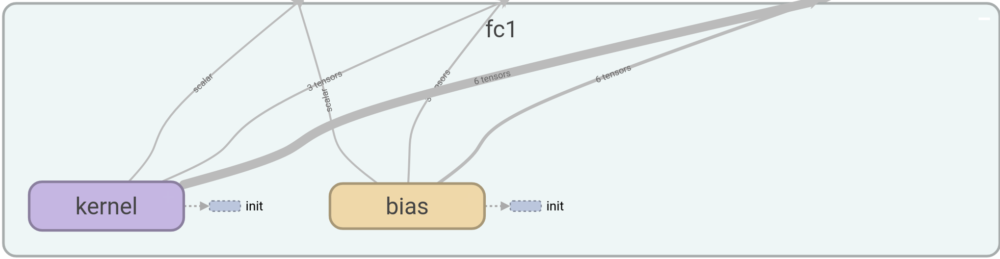

#### optimize

这一模块定义了模型的优化过程。

1. 使用`softmax`交叉熵作为损失函数衡量模型输出与实际标签之间的差异。
2. 计算平均损失得到整体的损失值。
3. 使用`Adam`优化器以给定的学习率对损失进行优化，通过调整模型参数以最小化损失。

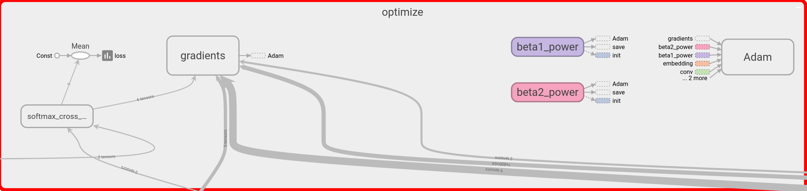

#### accuracy

这一模块计算了模型的分类准确率。

1. 比较模型预测的类别与实际标签的一致性，得到一个布尔型的张量。
2. 将布尔值转换为浮点数，计算平均值，得到模型在当前批次上的准确率。

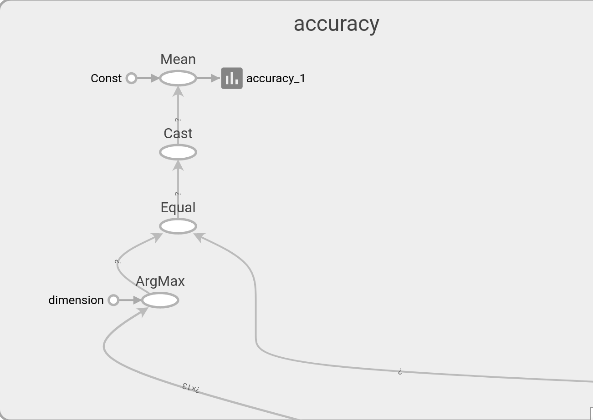

### 超参数配置

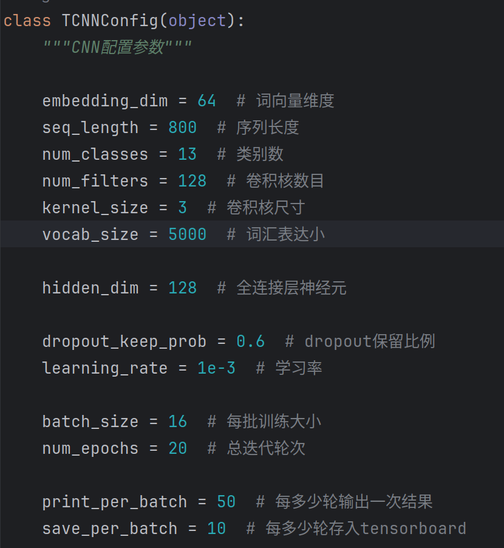

### 训练过程

#### 记录

```text
Training and evaluating...
Epoch: 1
Iter:      0, Train Loss:    2.6, Train Acc:   0.00%, Val Loss:    2.6, Val Acc:   3.26%, Time: 0:00:02 *
Iter:     50, Train Loss:    2.2, Train Acc:  37.50%, Val Loss:    2.2, Val Acc:  32.54%, Time: 0:00:08 *
Iter:    100, Train Loss:    2.2, Train Acc:  25.00%, Val Loss:    2.1, Val Acc:  36.67%, Time: 0:00:14 *
Iter:    150, Train Loss:    1.5, Train Acc:  50.00%, Val Loss:    1.9, Val Acc:  44.88%, Time: 0:00:20 *
Iter:    200, Train Loss:    2.2, Train Acc:  25.00%, Val Loss:    1.7, Val Acc:  47.96%, Time: 0:00:28 *
Iter:    250, Train Loss:   0.85, Train Acc:  81.25%, Val Loss:    1.6, Val Acc:  50.70%, Time: 0:00:34 *
Iter:    300, Train Loss:    1.2, Train Acc:  56.25%, Val Loss:    1.5, Val Acc:  54.71%, Time: 0:00:39 *
Epoch: 2
Iter:    350, Train Loss:    1.5, Train Acc:  43.75%, Val Loss:    1.4, Val Acc:  57.80%, Time: 0:00:45 *
Iter:    400, Train Loss:    1.4, Train Acc:  62.50%, Val Loss:    1.3, Val Acc:  59.78%, Time: 0:00:50 *
Iter:    450, Train Loss:    1.4, Train Acc:  56.25%, Val Loss:    1.3, Val Acc:  61.18%, Time: 0:00:56 *
Iter:    500, Train Loss:    1.1, Train Acc:  56.25%, Val Loss:    1.3, Val Acc:  61.53%, Time: 0:01:01 *
Iter:    550, Train Loss:    1.2, Train Acc:  68.75%, Val Loss:    1.2, Val Acc:  62.98%, Time: 0:01:06 *
Iter:    600, Train Loss:    1.7, Train Acc:  43.75%, Val Loss:    1.2, Val Acc:  62.98%, Time: 0:01:11 *
Epoch: 3
Iter:    650, Train Loss:   0.57, Train Acc:  81.25%, Val Loss:    1.2, Val Acc:  63.39%, Time: 0:01:17 *
Iter:    700, Train Loss:    0.9, Train Acc:  75.00%, Val Loss:    1.2, Val Acc:  63.39%, Time: 0:01:22 *
Iter:    750, Train Loss:   0.83, Train Acc:  68.75%, Val Loss:    1.1, Val Acc:  66.82%, Time: 0:01:27 *
Iter:    800, Train Loss:    0.9, Train Acc:  68.75%, Val Loss:    1.1, Val Acc:  66.01%, Time: 0:01:32
Iter:    850, Train Loss:   0.99, Train Acc:  56.25%, Val Loss:    1.1, Val Acc:  67.17%, Time: 0:01:37 *
Iter:    900, Train Loss:    1.3, Train Acc:  62.50%, Val Loss:    1.1, Val Acc:  68.74%, Time: 0:01:42 *
Epoch: 4
Iter:    950, Train Loss:   0.48, Train Acc:  81.25%, Val Loss:    1.0, Val Acc:  69.67%, Time: 0:01:47 *
Iter:   1000, Train Loss:   0.86, Train Acc:  81.25%, Val Loss:    1.0, Val Acc:  69.09%, Time: 0:01:51
Iter:   1050, Train Loss:   0.66, Train Acc:  87.50%, Val Loss:    1.1, Val Acc:  66.88%, Time: 0:01:56
Iter:   1100, Train Loss:   0.59, Train Acc:  81.25%, Val Loss:    1.0, Val Acc:  70.31%, Time: 0:02:01 *
Iter:   1150, Train Loss:    0.8, Train Acc:  68.75%, Val Loss:    1.0, Val Acc:  69.62%, Time: 0:02:06
Iter:   1200, Train Loss:   0.86, Train Acc:  75.00%, Val Loss:    1.0, Val Acc:  69.38%, Time: 0:02:11
Epoch: 5
Iter:   1250, Train Loss:   0.67, Train Acc:  75.00%, Val Loss:    1.0, Val Acc:  69.62%, Time: 0:02:16
Iter:   1300, Train Loss:    0.6, Train Acc:  87.50%, Val Loss:    1.1, Val Acc:  68.80%, Time: 0:02:22
Iter:   1350, Train Loss:   0.53, Train Acc:  87.50%, Val Loss:    1.0, Val Acc:  68.74%, Time: 0:02:27
Iter:   1400, Train Loss:   0.87, Train Acc:  75.00%, Val Loss:    1.0, Val Acc:  70.55%, Time: 0:02:33 *
Iter:   1450, Train Loss:   0.52, Train Acc:  81.25%, Val Loss:    1.0, Val Acc:  71.48%, Time: 0:02:39 *
Iter:   1500, Train Loss:   0.54, Train Acc:  75.00%, Val Loss:   0.99, Val Acc:  71.19%, Time: 0:02:45
Epoch: 6
Iter:   1550, Train Loss:   0.47, Train Acc:  81.25%, Val Loss:   0.99, Val Acc:  71.94%, Time: 0:02:50 *
Iter:   1600, Train Loss:   0.49, Train Acc:  87.50%, Val Loss:    1.1, Val Acc:  70.37%, Time: 0:02:56
Iter:   1650, Train Loss:   0.12, Train Acc: 100.00%, Val Loss:    1.0, Val Acc:  72.24%, Time: 0:03:01 *
Iter:   1700, Train Loss:   0.34, Train Acc:  93.75%, Val Loss:    1.1, Val Acc:  71.25%, Time: 0:03:06
Iter:   1750, Train Loss:   0.14, Train Acc: 100.00%, Val Loss:    1.0, Val Acc:  71.83%, Time: 0:03:10
Iter:   1800, Train Loss:   0.38, Train Acc:  81.25%, Val Loss:    1.0, Val Acc:  71.19%, Time: 0:03:15
Epoch: 7
Iter:   1850, Train Loss:  0.095, Train Acc: 100.00%, Val Loss:    1.1, Val Acc:  71.42%, Time: 0:03:20
Iter:   1900, Train Loss:  0.082, Train Acc: 100.00%, Val Loss:    1.1, Val Acc:  72.12%, Time: 0:03:25
Iter:   1950, Train Loss:   0.15, Train Acc: 100.00%, Val Loss:    1.1, Val Acc:  72.24%, Time: 0:03:30
Iter:   2000, Train Loss:    0.2, Train Acc:  93.75%, Val Loss:    1.1, Val Acc:  72.41%, Time: 0:03:36 *
Iter:   2050, Train Loss:   0.14, Train Acc:  93.75%, Val Loss:    1.1, Val Acc:  72.64%, Time: 0:03:40 *
Iter:   2100, Train Loss:   0.28, Train Acc:  87.50%, Val Loss:    1.1, Val Acc:  72.29%, Time: 0:03:45
Epoch: 8
Iter:   2150, Train Loss:   0.19, Train Acc:  93.75%, Val Loss:    1.1, Val Acc:  72.00%, Time: 0:03:49
Iter:   2200, Train Loss:   0.23, Train Acc:  93.75%, Val Loss:    1.1, Val Acc:  72.64%, Time: 0:03:54
Iter:   2250, Train Loss:   0.16, Train Acc: 100.00%, Val Loss:    1.1, Val Acc:  71.71%, Time: 0:03:59
Iter:   2300, Train Loss:   0.37, Train Acc:  81.25%, Val Loss:    1.1, Val Acc:  73.28%, Time: 0:04:04 *
Iter:   2350, Train Loss:  0.082, Train Acc: 100.00%, Val Loss:    1.1, Val Acc:  73.11%, Time: 0:04:09
Iter:   2400, Train Loss:   0.25, Train Acc:  87.50%, Val Loss:    1.2, Val Acc:  72.00%, Time: 0:04:14
Epoch: 9
Iter:   2450, Train Loss:  0.055, Train Acc: 100.00%, Val Loss:    1.2, Val Acc:  72.76%, Time: 0:04:19
Iter:   2500, Train Loss:  0.081, Train Acc: 100.00%, Val Loss:    1.2, Val Acc:  72.76%, Time: 0:04:23
Iter:   2550, Train Loss:  0.016, Train Acc: 100.00%, Val Loss:    1.3, Val Acc:  72.70%, Time: 0:04:28
Iter:   2600, Train Loss:   0.12, Train Acc:  93.75%, Val Loss:    1.2, Val Acc:  72.47%, Time: 0:04:33
Iter:   2650, Train Loss:  0.027, Train Acc: 100.00%, Val Loss:    1.3, Val Acc:  72.29%, Time: 0:04:38
Iter:   2700, Train Loss:   0.16, Train Acc: 100.00%, Val Loss:    1.2, Val Acc:  71.89%, Time: 0:04:43
Epoch: 10
Iter:   2750, Train Loss:  0.071, Train Acc: 100.00%, Val Loss:    1.3, Val Acc:  72.58%, Time: 0:04:48
Iter:   2800, Train Loss:  0.053, Train Acc: 100.00%, Val Loss:    1.3, Val Acc:  72.99%, Time: 0:04:53
Iter:   2850, Train Loss:  0.025, Train Acc: 100.00%, Val Loss:    1.3, Val Acc:  73.28%, Time: 0:04:59
Iter:   2900, Train Loss:  0.024, Train Acc: 100.00%, Val Loss:    1.3, Val Acc:  72.70%, Time: 0:05:04
Iter:   2950, Train Loss:   0.12, Train Acc: 100.00%, Val Loss:    1.3, Val Acc:  72.76%, Time: 0:05:09
Iter:   3000, Train Loss:  0.048, Train Acc: 100.00%, Val Loss:    1.3, Val Acc:  71.83%, Time: 0:05:14
Epoch: 11
Iter:   3050, Train Loss:   0.02, Train Acc: 100.00%, Val Loss:    1.3, Val Acc:  72.00%, Time: 0:05:19
Iter:   3100, Train Loss:  0.024, Train Acc: 100.00%, Val Loss:    1.3, Val Acc:  72.58%, Time: 0:05:24
Iter:   3150, Train Loss:  0.028, Train Acc: 100.00%, Val Loss:    1.3, Val Acc:  72.53%, Time: 0:05:29
Iter:   3200, Train Loss:    0.1, Train Acc:  93.75%, Val Loss:    1.5, Val Acc:  73.11%, Time: 0:05:34
Iter:   3250, Train Loss: 0.0065, Train Acc: 100.00%, Val Loss:    1.4, Val Acc:  72.35%, Time: 0:05:39
Iter:   3300, Train Loss:  0.042, Train Acc: 100.00%, Val Loss:    1.4, Val Acc:  72.41%, Time: 0:05:44
No optimization for a long time, auto-stopping...
```

#### 准确率曲线

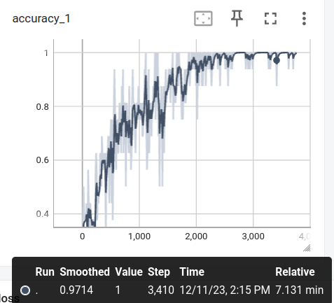

#### 损失曲线

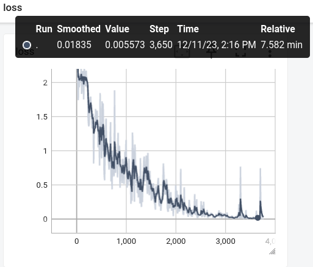

### 模型性能评价

根据混淆矩阵计算得到每个类别对应的准确率、召回率、F1得分。

```text
Testing...
Test Loss:    1.3, Test Acc:  70.32%
Precision, Recall and F1-Score...
              precision    recall  f1-score   support

     疼痛科 麻醉科       0.66      0.58      0.62        65
          儿科       0.68      0.65      0.67        55
        内分泌科       0.74      0.67      0.70        39
         急诊科       0.32      0.51      0.39        45
          骨科       0.70      0.74      0.72        54
         皮肤科       0.61      0.62      0.61        50
         妇产科       0.58      0.71      0.64        73
          内科       0.69      0.67      0.68       289
     感染科 传染科       0.60      0.55      0.57        53
         肿瘤科       0.66      0.59      0.62        59
          眼科       0.94      0.82      0.88        61
         性病科       0.81      0.65      0.72        74
          外科       0.78      0.79      0.79       488

    accuracy                           0.70      1405
   macro avg       0.68      0.66      0.66      1405
weighted avg       0.71      0.70      0.71      1405
```

不难看出，模型在预测“眼科”“外科”类别效果较好，在预测“急诊科”类别效果较差。

#### 混淆矩阵

```text
Confusion Matrix...
[[ 38   1   0   5   7   1   0   4   1   1   0   0   7]
 [  0  36   0   2   0   1   0   7   0   0   1   0   8]
 [  0   0  26   1   0   0   1   2   0   1   0   0   8]
 [  1   3   0  23   0   1   4  10   1   0   0   0   2]
 [  3   0   1   0  40   0   1   2   0   0   0   0   7]
 [  0   1   0   0   1  31   4   3   0   0   0   3   7]
 [  1   0   0   4   0   2  52   8   2   0   0   1   3]
 [  6   7   1  18   2   2   6 193   9   5   2   2  36]
 [  0   2   0   2   1   1   2   8  29   0   0   0   8]
 [  0   0   1   4   1   0   1   5   0  35   0   0  12]
 [  0   1   0   0   0   2   1   4   0   0  50   1   2]
 [  1   0   1   1   1   1   9   2   0   0   0  48  10]
 [  8   2   5  12   4   9   9  31   6  11   0   4 387]]
```

## RNN（循环神经网络）

由于RNN模型训练较慢，我们在`Colabtory`使用GPU资源来训练。

### 模型结构

> RNN用的是GRU

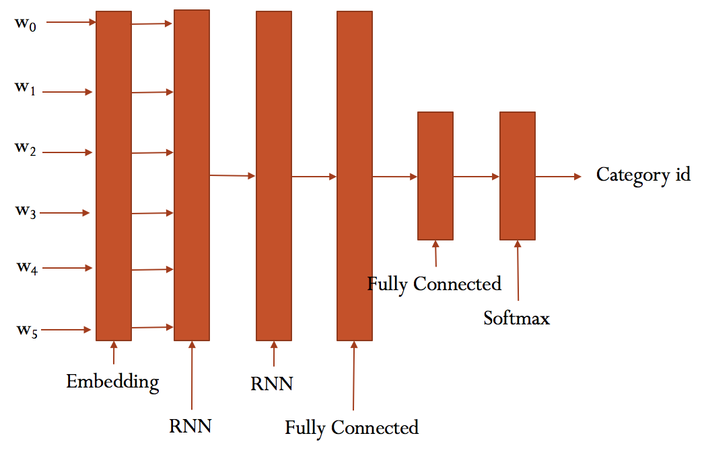

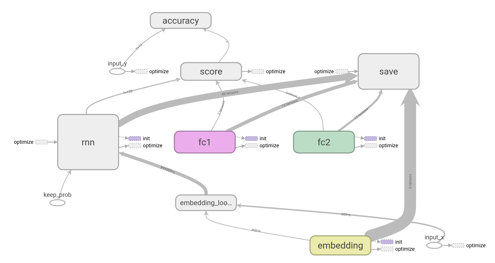

下面简要讲述一下各个模块的思路：

#### embedding

这一模块创建了一个词嵌入矩阵，其中每行对应一个词汇表中的单词。

1. 将输入序列中的单词索引映射为对应的词嵌入向量，得到嵌入输入。
2. 此过程用于将离散的词汇信息转化为密集的词嵌入表示，以便于神经网络模型的处理。

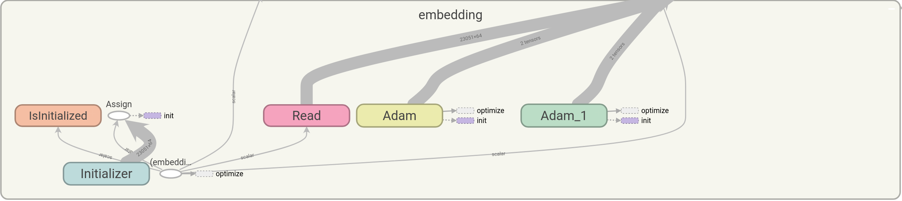

#### rnn

这一模块创建了一个多层的循环神经网络（RNN）模型。

1. 将多个RNN单元组合成多层结构。
2. 将嵌入输入序列经过多层RNN层处理，得到时序输出。
3. 从这些时序输出中选择最后一个时刻的输出，作为整个序列的表示，以供后续任务使用。

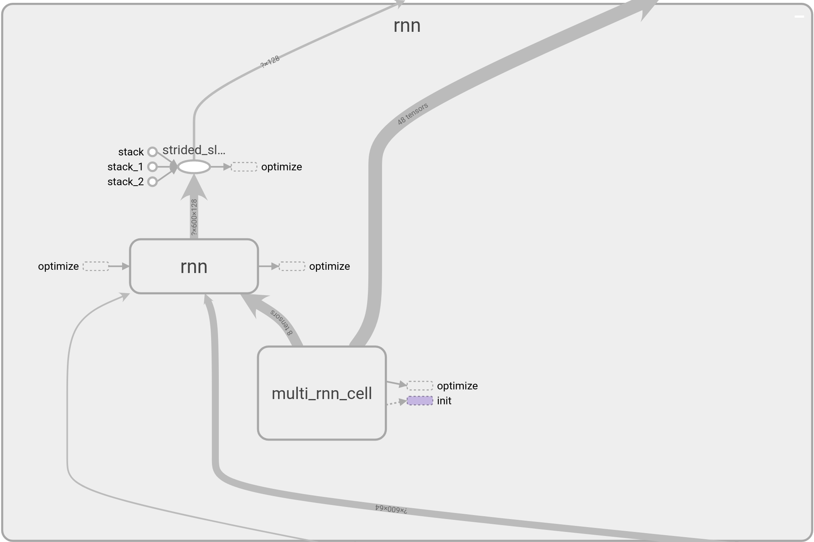

#### score

这一模块通过全连接层和激活函数构建了一个分类器。

1. 使用一个全连接层（`fc1`）将RNN输出进行映射到隐藏维度。
2. 使用`dropout`正则化和`ReLU`激活函数。
3. 使用另一个全连接层（`fc2`）将映射后的特征进一步映射到输出类别的空间。
4. 使用`softmax`函数获取类别概率，最终通过`argmax`得到预测类别。

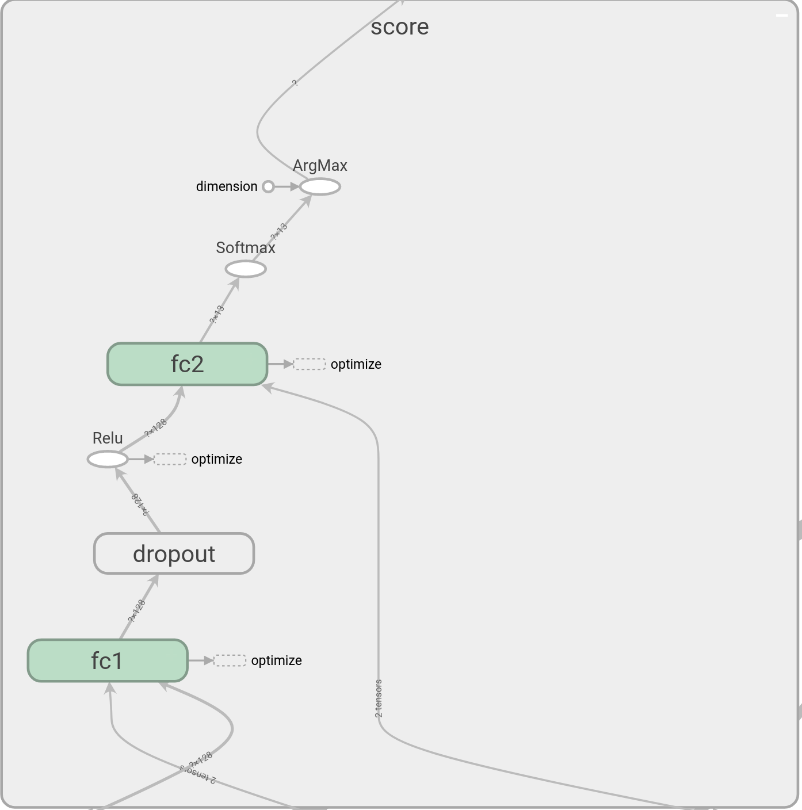

#### optimize

这一模块定义了模型的优化过程。

1. 使用`softmax`交叉熵作为损失函数衡量模型输出与实际标签之间的差异。
2. 计算平均损失得到整体的损失值。
3. 使用`Adam`优化器以给定的学习率对损失进行优化，通过调整模型参数以最小化损失。

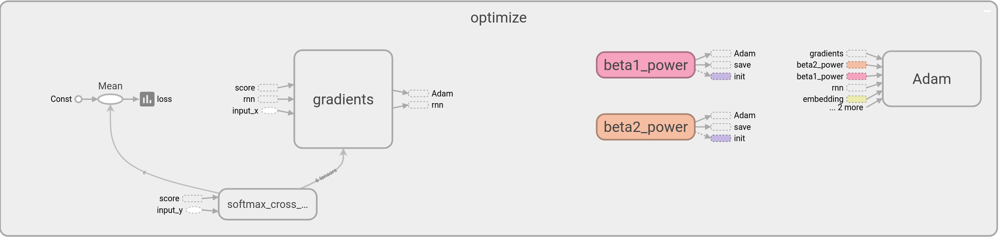

#### accuracy

这一模块计算了模型的分类准确率。

1. 比较模型预测的类别与实际标签的一致性，得到一个布尔型的张量。
2. 将布尔值转换为浮点数，计算平均值，得到模型在当前批次上的准确率。

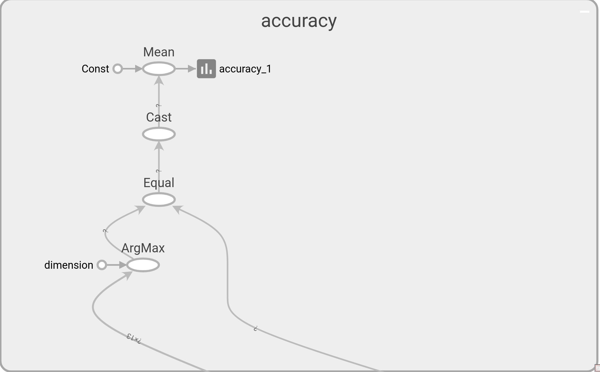

### 超参数配置

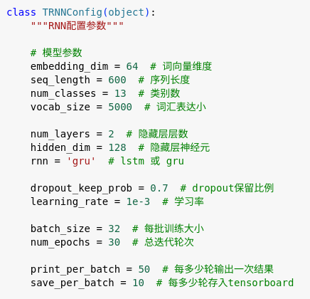

### 训练过程

#### 记录

由于输出长度限制，训练过程记录并不完整，只记录了3000次左右的迭代，但图像准确保存了每一次的训练结果。

```text
Training and evaluating...
Epoch: 1
Iter:      0, Train Loss:    2.6, Train Acc:   6.25%, Val Loss:    2.6, Val Acc:   3.49%, Time: 0:00:15 *
Iter:     50, Train Loss:    2.2, Train Acc:  31.25%, Val Loss:    2.1, Val Acc:  32.48%, Time: 0:01:51 *
Iter:    100, Train Loss:    2.0, Train Acc:  25.00%, Val Loss:    2.0, Val Acc:  32.89%, Time: 0:03:21 *
Iter:    150, Train Loss:    1.8, Train Acc:  46.88%, Val Loss:    2.0, Val Acc:  35.04%, Time: 0:04:53 *
Epoch: 2
Iter:    200, Train Loss:    2.2, Train Acc:  25.00%, Val Loss:    1.9, Val Acc:  35.27%, Time: 0:06:24 *
Iter:    250, Train Loss:    2.0, Train Acc:  37.50%, Val Loss:    1.8, Val Acc:  41.44%, Time: 0:07:55 *
Iter:    300, Train Loss:    1.5, Train Acc:  46.88%, Val Loss:    1.8, Val Acc:  44.99%, Time: 0:09:25 *
Epoch: 3
Iter:    350, Train Loss:    1.7, Train Acc:  43.75%, Val Loss:    1.8, Val Acc:  46.62%, Time: 0:10:58 *
Iter:    400, Train Loss:    1.8, Train Acc:  46.88%, Val Loss:    1.7, Val Acc:  48.60%, Time: 0:12:28 *
Iter:    450, Train Loss:    1.4, Train Acc:  65.62%, Val Loss:    1.6, Val Acc:  52.21%, Time: 0:13:58 *
Epoch: 4
Iter:    500, Train Loss:    1.1, Train Acc:  68.75%, Val Loss:    1.6, Val Acc:  52.44%, Time: 0:15:29 *
Iter:    550, Train Loss:    1.2, Train Acc:  59.38%, Val Loss:    1.5, Val Acc:  54.31%, Time: 0:17:01 *
Iter:    600, Train Loss:    1.4, Train Acc:  53.12%, Val Loss:    1.5, Val Acc:  54.89%, Time: 0:18:32 *
Epoch: 5
Iter:    650, Train Loss:    1.0, Train Acc:  59.38%, Val Loss:    1.5, Val Acc:  55.65%, Time: 0:20:03 *
Iter:    700, Train Loss:    1.0, Train Acc:  65.62%, Val Loss:    1.5, Val Acc:  52.62%, Time: 0:21:35
Iter:    750, Train Loss:    1.3, Train Acc:  59.38%, Val Loss:    1.4, Val Acc:  56.00%, Time: 0:23:06 *
Epoch: 6
Iter:    800, Train Loss:    1.3, Train Acc:  62.50%, Val Loss:    1.4, Val Acc:  57.22%, Time: 0:24:37 *
Iter:    850, Train Loss:    1.0, Train Acc:  65.62%, Val Loss:    1.4, Val Acc:  56.29%, Time: 0:26:09
Iter:    900, Train Loss:    1.1, Train Acc:  65.62%, Val Loss:    1.4, Val Acc:  57.74%, Time: 0:27:39 *
Epoch: 7
Iter:    950, Train Loss:    1.0, Train Acc:  68.75%, Val Loss:    1.4, Val Acc:  59.55%, Time: 0:29:10 *
Iter:   1000, Train Loss:   0.82, Train Acc:  59.38%, Val Loss:    1.4, Val Acc:  56.52%, Time: 0:30:43
Iter:   1050, Train Loss:   0.91, Train Acc:  68.75%, Val Loss:    1.3, Val Acc:  59.84%, Time: 0:32:14 *
Epoch: 8
Iter:   1100, Train Loss:   0.59, Train Acc:  81.25%, Val Loss:    1.4, Val Acc:  60.30%, Time: 0:33:45 *
Iter:   1150, Train Loss:   0.47, Train Acc:  93.75%, Val Loss:    1.3, Val Acc:  59.43%, Time: 0:35:18
Iter:   1200, Train Loss:   0.71, Train Acc:  75.00%, Val Loss:    1.3, Val Acc:  60.71%, Time: 0:36:49 *
Epoch: 9
Iter:   1250, Train Loss:   0.85, Train Acc:  81.25%, Val Loss:    1.3, Val Acc:  60.01%, Time: 0:38:19
Iter:   1300, Train Loss:   0.56, Train Acc:  75.00%, Val Loss:    1.3, Val Acc:  61.76%, Time: 0:39:53 *
Iter:   1350, Train Loss:    1.1, Train Acc:  62.50%, Val Loss:    1.3, Val Acc:  62.63%, Time: 0:41:23 *
Epoch: 10
Iter:   1400, Train Loss:   0.62, Train Acc:  75.00%, Val Loss:    1.4, Val Acc:  60.01%, Time: 0:42:53
Iter:   1450, Train Loss:   0.58, Train Acc:  81.25%, Val Loss:    1.4, Val Acc:  59.78%, Time: 0:44:26
Iter:   1500, Train Loss:    1.1, Train Acc:  71.88%, Val Loss:    1.4, Val Acc:  61.47%, Time: 0:45:55
Epoch: 11
Iter:   1550, Train Loss:   0.72, Train Acc:  75.00%, Val Loss:    1.4, Val Acc:  64.49%, Time: 0:47:25 *
Iter:   1600, Train Loss:   0.26, Train Acc:  93.75%, Val Loss:    1.4, Val Acc:  61.18%, Time: 0:48:56
Iter:   1650, Train Loss:   0.76, Train Acc:  68.75%, Val Loss:    1.4, Val Acc:  61.76%, Time: 0:50:28
Epoch: 12
Iter:   1700, Train Loss:   0.15, Train Acc:  93.75%, Val Loss:    1.4, Val Acc:  64.44%, Time: 0:51:57
Iter:   1750, Train Loss:   0.34, Train Acc:  87.50%, Val Loss:    1.4, Val Acc:  62.46%, Time: 0:53:27
Iter:   1800, Train Loss:   0.39, Train Acc:  87.50%, Val Loss:    1.4, Val Acc:  63.04%, Time: 0:55:00
Epoch: 13图像
Iter:   1850, Train Loss:   0.78, Train Acc:  71.88%, Val Loss:    1.5, Val Acc:  63.80%, Time: 0:56:30
Iter:   1900, Train Loss:   0.55, Train Acc:  84.38%, Val Loss:    1.4, Val Acc:  64.73%, Time: 0:58:00 *
Iter:   1950, Train Loss:   0.45, Train Acc:  87.50%, Val Loss:    1.4, Val Acc:  64.49%, Time: 0:59:31
Epoch: 14
Iter:   2000, Train Loss:   0.55, Train Acc:  84.38%, Val Loss:    1.5, Val Acc:  63.80%, Time: 1:01:02
Iter:   2050, Train Loss:   0.36, Train Acc:  84.38%, Val Loss:    1.5, Val Acc:  63.80%, Time: 1:02:32
Iter:   2100, Train Loss:   0.56, Train Acc:  78.12%, Val Loss:    1.5, Val Acc:  64.67%, Time: 1:04:01
Epoch: 15
Iter:   2150, Train Loss:   0.24, Train Acc:  90.62%, Val Loss:    1.5, Val Acc:  64.32%, Time: 1:05:33
Iter:   2200, Train Loss:   0.23, Train Acc:  93.75%, Val Loss:    1.6, Val Acc:  64.61%, Time: 1:07:04
Iter:   2250, Train Loss:   0.36, Train Acc:  90.62%, Val Loss:    1.6, Val Acc:  61.87%, Time: 1:08:33
Epoch: 16
Iter:   2300, Train Loss:   0.23, Train Acc:  93.75%, Val Loss:    1.6, Val Acc:  63.97%, Time: 1:10:03
Iter:   2350, Train Loss:   0.18, Train Acc:  93.75%, Val Loss:    1.5, Val Acc:  66.24%, Time: 1:11:35 *
Iter:   2400, Train Loss:   0.31, Train Acc:  90.62%, Val Loss:    1.5, Val Acc:  64.90%, Time: 1:13:05
Epoch: 17
Iter:   2450, Train Loss:   0.56, Train Acc:  81.25%, Val Loss:    1.5, Val Acc:  65.83%, Time: 1:14:34
Iter:   2500, Train Loss:   0.15, Train Acc:  93.75%, Val Loss:    1.6, Val Acc:  66.18%, Time: 1:16:04
Iter:   2550, Train Loss:   0.17, Train Acc:  93.75%, Val Loss:    1.6, Val Acc:  65.02%, Time: 1:17:36
Epoch: 18
Iter:   2600, Train Loss:   0.24, Train Acc:  90.62%, Val Loss:    1.6, Val Acc:  66.76%, Time: 1:19:05 *
Iter:   2650, Train Loss:   0.24, Train Acc:  93.75%, Val Loss:    1.7, Val Acc:  65.60%, Time: 1:20:34
Iter:   2700, Train Loss:   0.23, Train Acc:  93.75%, Val Loss:    1.6, Val Acc:  65.42%, Time: 1:22:05
Epoch: 19
Iter:   2750, Train Loss:   0.15, Train Acc:  93.75%, Val Loss:    1.7, Val Acc:  66.59%, Time: 1:23:36
Iter:   2800, Train Loss:   0.19, Train Acc:  90.62%, Val Loss:    1.7, Val Acc:  66.12%, Time: 1:25:05
Iter:   2850, Train Loss:   0.42, Train Acc:  87.50%, Val Loss:    1.7, Val Acc:  65.66%, Time: 1:26:35
Epoch: 20
Iter:   2900, Train Loss:   0.24, Train Acc:  93.75%, Val Loss:    1.6, Val Acc:  65.83%, Time: 1:28:04
Iter:   2950, Train Loss:  0.055, Train Acc: 100.00%, Val Loss:    1.8, Val Acc:  66.36%, Time: 1:29:37
```

#### 准确率曲线

根据曲线判断，模型大概在GPU下跑了2个多小时，在训练集上效果较好。

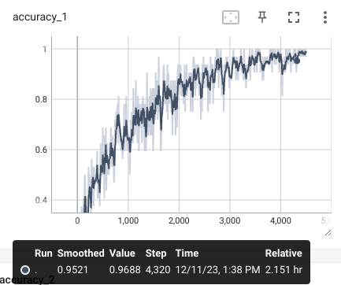

#### 损失曲线

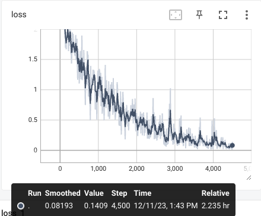

### 模型性能评价

根据混淆矩阵计算得到每个类别对应的准确率、召回率、F1得分。

```text
Testing...
Test Loss:    2.2, Test Acc:  62.06%
Precision, Recall and F1-Score...
              precision    recall  f1-score   support

     疼痛科 麻醉科       0.52      0.45      0.48        65
          儿科       0.57      0.56      0.57        55
        内分泌科       0.68      0.72      0.70        39
         急诊科       0.19      0.33      0.24        45
          骨科       0.60      0.61      0.61        54
         皮肤科       0.43      0.60      0.50        50
         妇产科       0.55      0.49      0.52        73
          内科       0.65      0.64      0.64       289
     感染科 传染科       0.48      0.57      0.52        53
         肿瘤科       0.44      0.34      0.38        59
          眼科       0.91      0.82      0.86        61
         性病科       0.53      0.49      0.51        74
          外科       0.74      0.72      0.73       488

    accuracy                           0.62      1405
   macro avg       0.56      0.56      0.56      1405
weighted avg       0.63      0.62      0.63      1405
```

不难看出，模型在预测“眼科”“外科”类别效果较好，在预测“疼痛科 麻醉科”“急诊科”类别效果较差。

#### 混淆矩阵

```text
Confusion Matrix...
[[ 29   1   0   6  10   0   1   0   2   1   0   4  11]
 [  0  31   0   3   0   2   2   8   2   0   2   1   4]
 [  2   0  28   0   0   1   2   2   0   1   0   0   3]
 [  0   1   0  15   0   3   4  14   1   0   1   2   4]
 [  3   1   0   1  33   3   1   3   0   0   0   1   8]
 [  1   2   0   1   1  30   3   1   0   0   0   2   9]
 [  1   0   0   8   3   4  36  11   1   0   0   4   5]
 [  6  11   4  26   0   3   4 184  14   3   1   1  32]
 [  1   0   0   1   1   2   2   7  30   2   0   1   6]
 [  2   1   2   2   1   2   0   5   3  20   0   1  20]
 [  1   1   0   1   0   1   0   3   0   0  50   0   4]
 [  0   0   0   4   0   9   4   2   2   0   0  36  17]
 [ 10   5   7  10   6  10   6  42   8  18   1  15 350]]
```

## 对比

|              |            CNN             |       RNN        |
| :----------: | :------------------------: | :--------------: |
|   训练用时   |      较快，CPU上5分钟      | 较慢，GPU上2小时 |
| 训练集准确率 |       较好，接近100%       |  较好，接近100%  |
| 测试集准确率 |      70.32%，优于RNN       |      62.06%      |
|   模型解释   | 捕捉文本中的关键短语或结构 | 捕捉文本序列信息 |

- 二者训练过程相似，仅使用的模型结构不一样，都包括词嵌入、得分计算、优化函数和准确率计算模块。

- 由于CNN的卷积操作具有天然的并行性，可以同时处理多个区域的输入。而RNN的序列依赖性导致难以实现有效的并行化，因为每个时间步都依赖于前一个时间步的输出。因此RNN即使在GPU上训练也仍然较慢。

- RNN的效果总体上不如CNN，说明捕捉文本序列信息的方法对医生科室分类的效果不好，而CNN在文本分类中可以通过卷积操作学习到局部特征，这对于捕捉文本中的关键短语或结构非常有效。CNN的局部特征学习可能比RNN更适用于该特定任务的分类。

## 改进方向

1. **调整模型架构：** 更深或更宽的神经网络结构，或者堆叠多个卷积层（循环层）或全连接层以增加模型的表达能力。
2. **使用预训练的词向量：** 使用预训练的词向量（例如Word2Vec、GloVe或FastText）可以提供更好的词汇表示，有助于模型更好地理解语义信息。
3. **集成学习：** 使用集成学习方法，如投票、Bagging或Boosting，结合多个模型的预测结果以提高整体性能。
4. **注意力机制：** 考虑引入注意力机制，使模型能够更加关注关键的词汇或片段。
